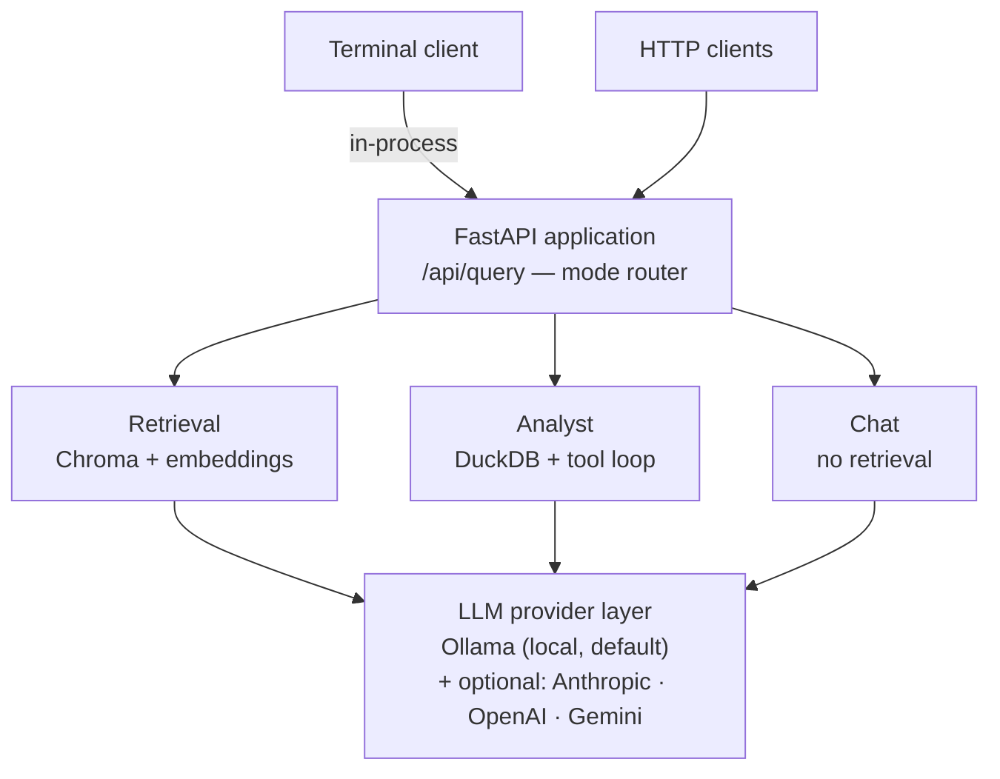

# AURA

**Adaptive Unified Retrieval Assistant**

A local AI assistant for **your** documents and **your** data. Every answer shows
its sources and the queries behind it, so you can check the work.

**Two ways to run it, chosen per request:**

- **Local** — Ollama on your own machine. No subscription, no API key, no network.
  This is the default, and it is a complete system on its own.
- **Cloud** — add an API key for Anthropic, OpenAI, or Gemini and route individual
  questions to a larger model with `/provider`. Entirely optional; the code never
  imports a provider you have not configured.

Either way, **embeddings always run locally**, so your documents are never sent
anywhere during indexing.

---

## What it does

Three ways of answering, one system:

| | Ask it | It does |
|---|---|---|
| **Documents** | *"How many days of parental leave do we get?"* | retrieves from your indexed files, answers with citations, **refuses** if they don't cover it |
| **Data** | *"Which region had the highest revenue?"* | writes SQL, runs it, shows you the query and the number |
| **Chat** | *"Write a Python file sorter"* | plain conversation, no retrieval |

The refusal is the point. An answer you can't trace to a source is
indistinguishable from a guess, so the document mode says *"I don't know"*
rather than filling the gap.

## Requirements

| | |
|---|---|
| Python | 3.11+ (verified on **3.13.5**) |
| [Ollama](https://ollama.com/download) | running locally |
| VRAM | ~5 GB for the default models |
| Disk | ~6 GB (models + dependencies) |

## Setup

```powershell
# 1. Models (~5 GB)
ollama pull qwen2.5:7b
ollama pull nomic-embed-text

# 2. Python environment
python -m venv .venv
.\.venv\Scripts\Activate.ps1
pip install -r requirements.txt

# 3. Config
Copy-Item .env.example .env
```

## Usage

Ask it a question from the terminal:

```powershell
cd backend
..\.venv\Scripts\python.exe scripts\ask.py
```

Add documents with `/ingest`, load spreadsheets with `/load`, then ask. Document
answers carry citations; data answers print the SQL that produced them before the
number itself, so you can read the query and decide whether you believe it.

### Commands

**Documents**

| Command | What it does |
|---|---|
| `/ingest <path>` | Add a file or folder to the knowledge base |
| `/docs` | List indexed documents |
| `/mode rag` | Answer from those documents (default) |
| `/reset` | Erase everything ingested (confirms first) |

**Data**

| Command | What it does |
|---|---|
| `/load <path>` | Add a spreadsheet or dataset |
| `/tables` | List loaded tables |
| `/mode analyst` | Answer by querying those tables |

**Any mode**

| Command | What it does |
|---|---|
| `/mode chat` | Plain conversation, no documents or data |
| `/provider <name>` | Switch LLM: `ollama` · `gemini` · `anthropic` · `openai` |
| `/model <name>` | Switch model within the current provider |
| `/models` | List what the current provider can serve |
| `/search on\|off` | Web-search grounding, where the provider supports it |
| `/status` | Provider, model, mode, documents, tables, output folder |
| `/clear` | Forget the conversation and clear the screen |
| `/help` · `/exit` | — |

Anything not starting with `/` is a question.

`/ingest` and `/load` are **not** interchangeable — a PDF goes to documents, a
spreadsheet goes to data. They use different engines and answer different kinds
of question.

**Documents:** `.pdf` `.docx` `.txt` `.md` `.csv` `.xlsx` `.xls`
**Data:** `.csv` `.tsv` `.xlsx` `.json` `.jsonl` `.parquet`

### Conversation and streaming

The session remembers the last six exchanges, so follow-ups work without
restating context:

```
> which region earned the most?
> now break that down by month
```

Document and chat answers **stream token by token** as the model produces them.
Analyst answers do not: the loop makes several model calls and only the last one
is the answer, so streaming would print tool calls rather than prose.

### Automatic mode selection

`/mode` forces a mode. Left alone, the system picks: questions with analytical
phrasing go to the analyst, questions go to document retrieval when documents are
indexed, and everything else falls through to chat. Routing is keyword-based and
readable in `main.py`, so when it picks wrong you can see exactly why.

### Single-question mode

Ask once and exit, without entering the session:

```powershell
..\.venv\Scripts\python.exe scripts\ask.py "How much parental leave?"
..\.venv\Scripts\python.exe scripts\ask.py --mode analyst "average revenue by region"
..\.venv\Scripts\python.exe scripts\ask.py --ingest ..\data\raw
..\.venv\Scripts\python.exe scripts\ask.py --provider anthropic --model claude-sonnet-5
```

### Inspection tools

```powershell
..\.venv\Scripts\python.exe scripts\models.py --all    # every model your keys can reach
..\.venv\Scripts\python.exe scripts\db_peek.py --full  # inspect both databases
```

`models.py` queries each configured provider live and annotates the results with
context window and cost. `db_peek.py` dumps the vector store and the SQLite
tables, including chunk counts per document.

## Output

Anything the assistant produces is written to one folder — `data/processed/` by
default, or wherever `ANALYST_OUTPUT_DIR` points.

| Output | Format | Why |
|---|---|---|
| **Charts** | `.png` at 150 dpi | opens in any image viewer, pastes into documents |
| **Full query results** | `.xlsx` | opens in Excel or any spreadsheet app |

Charts open automatically once written. Spreadsheets don't — they're saved as a
side effect, and launching Excel uninvited is rude.

A spreadsheet is written whenever a result is **larger than the model was shown**.
The model sees at most 50 rows, because every row costs context on every turn of
its reasoning; you get all of them. The answer in the terminal says so explicitly
rather than letting a partial view pass as complete.

`ANALYST_CHART_FORMAT` accepts `png`, `jpg`, `svg`, or `pdf`.

## Models

**Local by default; every cloud provider is optional.** With no API keys set,
nothing leaves your machine and no extra packages are needed.

```powershell
cd backend
..\.venv\Scripts\python.exe scripts\models.py         # browse
..\.venv\Scripts\python.exe scripts\models.py --all   # + guidance on each
```

### Local — Ollama (free, offline)

Defaults target an **8 GB VRAM budget**. Adjust `OLLAMA_CHAT_MODEL` in `.env`:

| VRAM | Model | Size |
|---|---|---|
| ~4 GB / no dedicated GPU | `llama3.2:3b` | ~2 GB |
| **8 GB (default)** | **`qwen2.5:7b`** | ~4.7 GB |
| 12–16 GB | `qwen2.5:14b` | ~9 GB |
| 24 GB+ | `qwen2.5:32b` | ~20 GB |

Embeddings always use `nomic-embed-text` (274 MB, 768 dims) regardless.

> On Windows, check VRAM with `nvidia-smi` — Task Manager and WMI both
> misreport it on some cards.

### Optional cloud providers

Each is registered only when its API key is present in `.env`. Same shape for all
three — install the client, add the key:

**Anthropic**

```powershell
pip install anthropic
# .env:  ANTHROPIC_API_KEY=sk-ant-...   ANTHROPIC_MODEL=claude-sonnet-5
```

**OpenAI**

```powershell
pip install openai
# .env:  OPENAI_API_KEY=sk-...          OPENAI_MODEL=gpt-5
```

**Gemini**

```powershell
pip install -r requirements.txt   # its client (httpx) is already in there
# .env:  GEMINI_API_KEY=...            GEMINI_MODEL=gemini-3.7-flash
```

| Provider | Client | Key | Model ids |
|---|---|---|---|
| **Anthropic** | `anthropic` | `ANTHROPIC_API_KEY` | `claude-opus-5` · `claude-sonnet-5` · `claude-haiku-4-5` |
| **OpenAI** | `openai` | `OPENAI_API_KEY` | fetched live |
| **Gemini** | `httpx` (bundled) | `GEMINI_API_KEY` | fetched live |

Ids for OpenAI and Gemini are fetched live rather than hard-coded — their
catalogues change often enough that a baked-in list goes stale and a wrong id
fails as a confusing 404.

`OPENAI_BASE_URL` reuses the OpenAI provider for any compatible API — **Groq**,
Together, OpenRouter, vLLM, LM Studio.

Pick one per request, without touching config:

```json
{ "question": "...", "provider": "anthropic", "model": "claude-sonnet-5" }
```

> **Embeddings never go to the cloud** — every cloud provider's `embed()` raises
> on purpose. Mixing embedding models silently destroys retrieval quality, so the
> vector store keeps one coordinate space.

## Architecture



**One rule holds this together:** no business logic imports a provider directly.
Everything goes through `LLMProvider`, so backends are swappable per request —
and every loop can be tested against a fake with no model running.

### How each mode works

```
documents:  question → embed → similarity search → grounded prompt → answer + sources
data:       question → model writes SQL → execute → model reads result → answer + queries
chat:       question → model
```

The data path is the one that's structurally different. Retrieval works because
the answer already exists as text somewhere. *"Average revenue by region"* exists
nowhere until something computes it — so the model stops producing the answer and
starts producing the **instructions** for getting it. Something else runs them.

Model-written SQL is executed behind an allowlist: `SELECT` and `WITH` only, no
multiple statements, row-capped, and errors are handed back to the model as text
it can read and correct rather than raised as exceptions.

### Where data lives

| Store | Owns | Why |
|---|---|---|
| **Chroma** (`data/vectorstore/`) | chunk text + vectors | answers "what resembles this?" |
| **DuckDB** (in memory) | loaded tables | answers "compute this" |
| **SQLite** (`data/app.db`) | document metadata, chat history | answers relational questions |

## API

Every capability above is also an HTTP API, so anything can drive it:

```powershell
cd backend
..\.venv\Scripts\python.exe -m uvicorn app.main:app --reload
```

Then **<http://127.0.0.1:8000/docs>** — every endpoint callable from the browser.

| Endpoint | Purpose |
|---|---|
| `POST /api/query` | **Unified entry point.** `mode`: `auto`/`chat`/`rag`/`analyst` |
| `POST /api/chat` · `/api/chat/stream` | Plain conversation, optionally streamed |
| `POST /api/rag/query` | Grounded answer with sources |
| `POST /api/rag/ingest` · `/api/rag/upload` | Add documents |
| `GET /api/rag/documents` | List indexed documents |
| `POST /api/rag/reset` | Wipe the vector store |
| `POST /api/analyst` | Query loaded data |
| `GET /api/models` | Available providers + models, fetched live |
| `GET /health` | System status |

Status codes are meaningful: **400** for a bad request, **503** when Ollama is
unreachable, **422** for a schema violation. `/api/legal` is a stub and returns
**501**.

Data is loaded through the terminal client; `/api/analyst` queries tables that
are already loaded.

## Project layout

```
aura/
├── backend/
│   ├── app/
│   │   ├── main.py              FastAPI entrypoint + mode router
│   │   ├── config.py            settings from .env
│   │   ├── deps.py              shared FastAPI dependencies
│   │   ├── routers/             chat · rag · analyst · legal
│   │   ├── rag/                 loaders · chunking · vectorstore
│   │   │                        ingest · retrieve · prompt
│   │   ├── analyst/             loader · tools · prompt · agent
│   │   ├── llm_providers/       base · ollama · anthropic · openai
│   │   │                        gemini · registry · catalog
│   │   ├── models/              Pydantic schemas
│   │   └── db/                  SQLAlchemy models + session
│   ├── scripts/
│   │   ├── ask.py               the terminal client
│   │   ├── healthcheck.py       end-to-end verification, PASS/FAIL per stage
│   │   ├── db_peek.py           inspect the databases
│   │   └── models.py            browse available models
│   └── tests/                   92 tests, 86 needing no model
├── data/
│   ├── raw/                     source documents and datasets
│   ├── processed/               charts and exports
│   ├── vectorstore/             Chroma persistence
│   └── app.db                   SQLite
└── docs/
```

Dependencies point only downward — `chunking.py` and `base.py` import nothing
from the app, which is why their tests need no Ollama, no database, no server.

## Tests

```powershell
cd backend
..\.venv\Scripts\python.exe -m pytest                       # all 92
..\.venv\Scripts\python.exe -m pytest -m "not integration"  # 86, no Ollama needed
..\.venv\Scripts\python.exe scripts\healthcheck.py         # end-to-end health check
```

Most tests run offline: chunking, prompt building, SQL safety, and the agent loop
are all tested with fakes, so they need no model and no network.

## Design decisions

Five choices that shape the rest of the system.

**Embeddings are pinned to one local model.** Every cloud provider's `embed()`
raises deliberately. Vectors from different embedding models occupy unrelated
coordinate spaces, and mixing them does not error — retrieval quality collapses
silently, with no exception and no obvious cause. Making it impossible beats
documenting it as discouraged.

**Model-written SQL runs behind an allowlist, not a blocklist.** `SELECT` and
`WITH` only, single statement, row-capped. Keyword filtering uses word boundaries
so a column named `last_update` is not mistaken for an `UPDATE` statement. A
blocklist always loses eventually; an allowlist fails closed.

**Tool errors are returned, never raised.** A failed query comes back as
`ToolResult(ok=False)` carrying the database's own error text, which goes into the
model's next message. The model reads it and corrects its own SQL. Raising would
end the conversation; returning continues it, and self-correction is the entire
value of an agent loop.

**Retrieval happens before generation, and an empty retrieval short-circuits.**
When nothing relevant is found, the language model is never called — a 7B model
handed no context will confabulate fluently. The refusal is returned directly.

**No business logic imports a provider.** Everything goes through the
`LLMProvider` interface, so backends swap per request and every loop can be
exercised against a fake with no model running. That is why 86 of 92 tests need
neither Ollama nor a network.

## Documentation

**[docs/info.md](docs/info.md)** — system overview, the databases, architecture and
pipeline diagrams, and the full list of constraints and invariants.

## Licence

MIT — see [LICENSE](LICENSE). Use it, fork it, change it, ship it; keep the
copyright notice and it comes with no warranty.

## Privacy

Fully local by default — documents, embeddings, and queries never leave your
machine. Every cloud provider is inert unless you set its API key, and even then
**embeddings are always computed locally**, so your document contents are never
sent to a cloud provider during ingestion.
