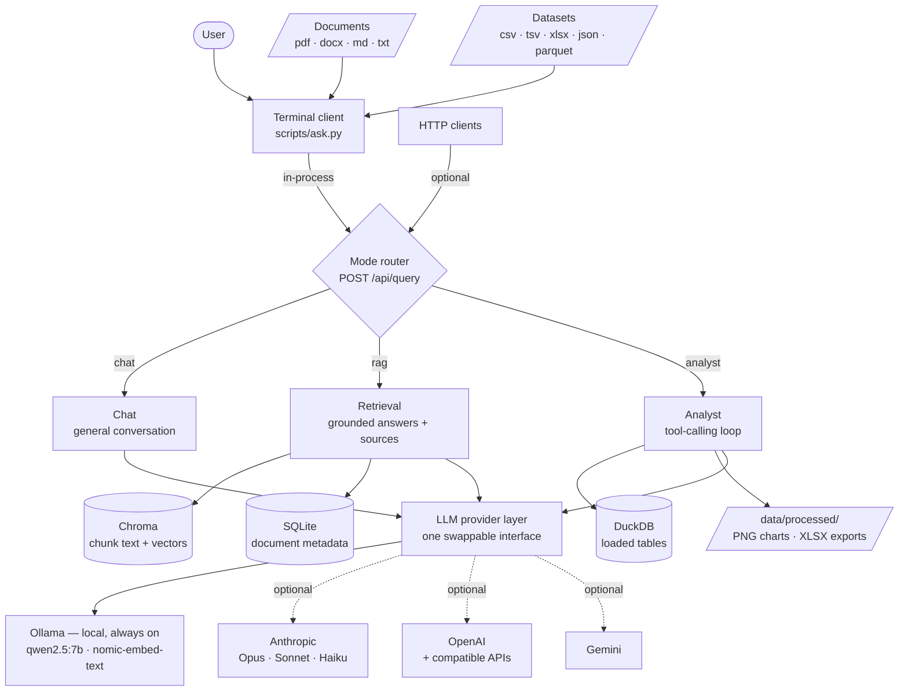
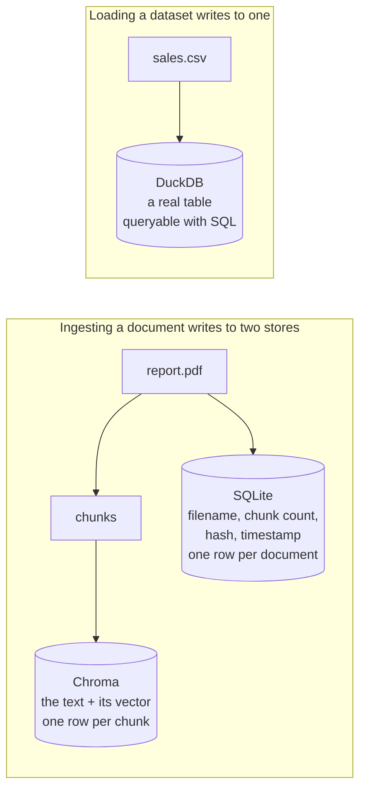
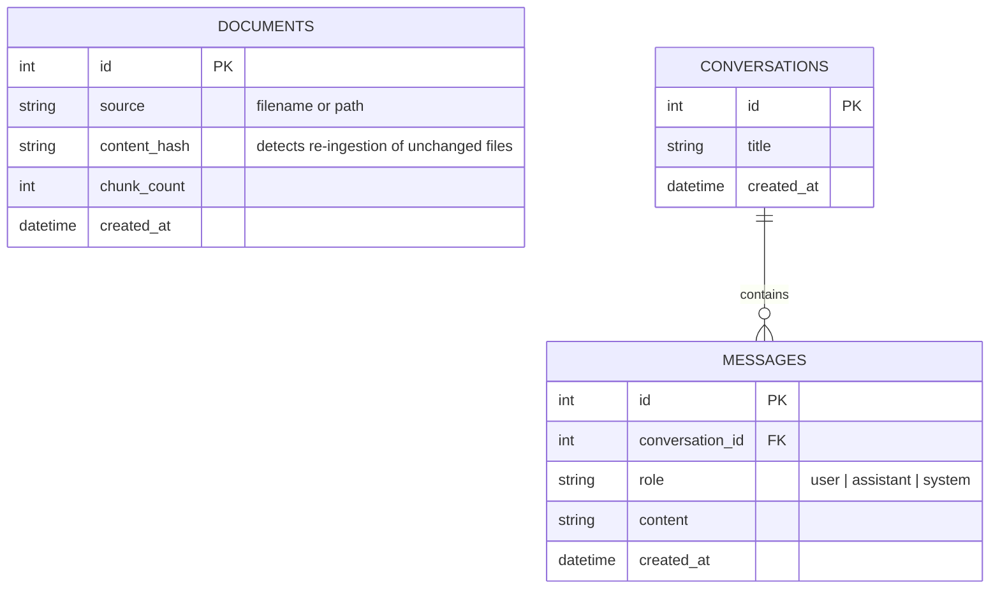
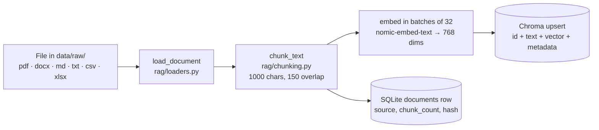
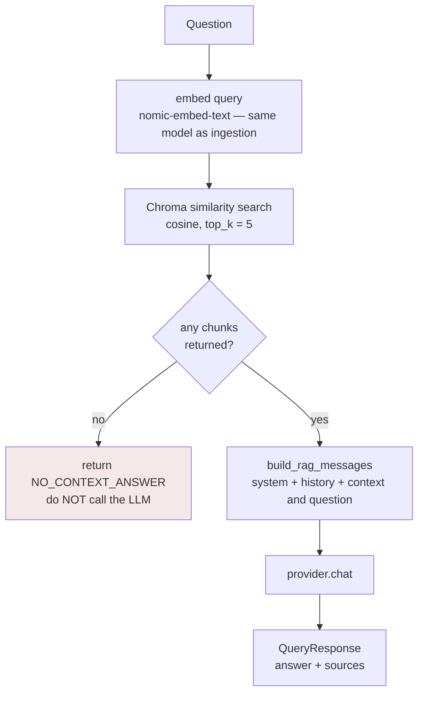
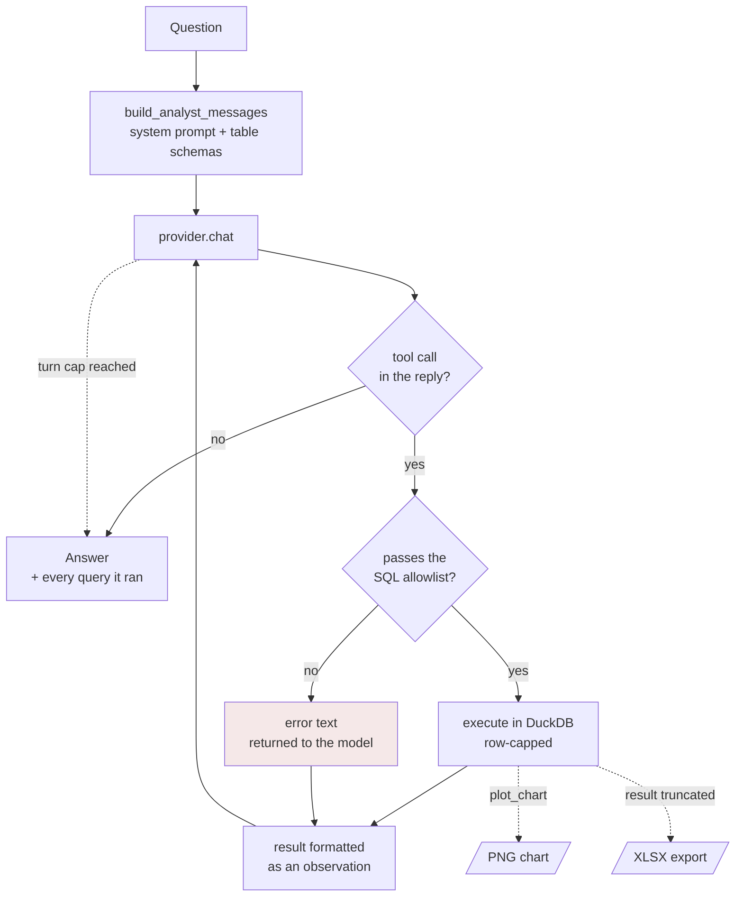
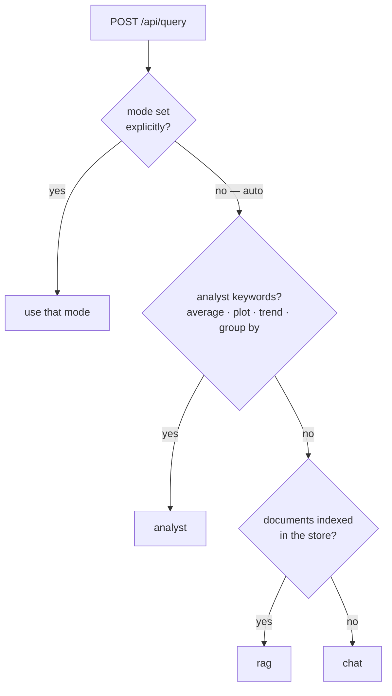

# System Overview, Databases & Diagrams

What the system is, what is stored where, and diagrams you can paste straight
into <https://mermaid.live>.

> **Using the diagrams:** copy the code *inside* each block — everything between
> the ` ```mermaid ` and closing ` ``` ` lines, not the fence itself — and paste
> it into the left-hand editor at mermaid.live. GitHub and VS Code (with the
> Markdown Preview Mermaid extension) render them inline too.

---

## What this is

A local AI assistant with three ways of answering, behind a single API:

| Mode | Endpoint | What it does |
|---|---|---|
| **Chat** | `/api/chat` | Plain conversation, no retrieval |
| **Documents** | `/api/rag/query` | Answers grounded in your indexed files, with citations |
| **Data** | `/api/analyst` | Writes SQL against loaded tables, runs it, reads the result |

Runs on your own machine through Ollama. Cloud providers are optional and
inert until an API key is set.

`/api/legal` exists as a stub and returns **501** — a fine-tuned legal model is
planned but not built.

## Stack

| Layer | Choice | Why |
|---|---|---|
| LLM runtime | **Ollama** — `qwen2.5:7b` | local, free, offline; 4.7 GB fits an 8 GB VRAM budget |
| Optional cloud | Anthropic · OpenAI · Gemini | all optional; inert without an API key — see [Models](#models) |
| Embeddings | **`nomic-embed-text`** | local, 768 dims, 274 MB — never cloud |
| Vector store | **Chroma** | embedded, no server process |
| Analytical engine | **DuckDB** | in-process SQL over CSV/Parquet; no server, no load step |
| Relational DB | **SQLite** + SQLAlchemy 2.0 | zero-config, file-based |
| Charts | **matplotlib** (Agg backend) | writes PNG directly; no browser, no headless renderer |
| API | **FastAPI** + Pydantic v2 | async, typed, auto-generated `/docs` |
| Interfaces | Terminal client · HTTP API | the client runs the pipeline in-process; the API exposes the same functions |
| Runtime | Python 3.13.5 | verified |

---

## System architecture



The rule holding this together: **no business logic imports a provider
directly.** Everything goes through `LLMProvider`, so backends swap per request,
and every pipeline can be exercised against a fake with no model running.

---

# Models

**Local is the default and always works. Every cloud provider is optional** — with
no API keys set, nothing leaves your machine and no extra packages are needed.

Model lists are **fetched live** from each provider, so they never go stale:

```powershell
cd backend
..\.venv\Scripts\python.exe scripts\models.py        # terminal
# or GET http://127.0.0.1:8000/api/models            # same data, as JSON
```

## Local — Ollama (free, private, offline)

| Model | Size | Context | Use when |
|---|---|---|---|
| `llama3.2:3b` | ~2 GB | 128K | No dedicated GPU, or a very tight VRAM budget |
| **`qwen2.5:7b`** | **~4.7 GB** | **32K** | **Default here — sized for an 8 GB VRAM budget** |
| `qwen2.5:14b` | ~9 GB | 32K | 12–16 GB VRAM; noticeably better reasoning |
| `qwen2.5:32b` | ~20 GB | 32K | 24 GB+ VRAM |
| **`nomic-embed-text`** | 274 MB | 2K | **The embedder — 768 dims. Never swap without resetting the store** |

Pull any of them with `ollama pull <name>`.

## Optional — Anthropic (Claude)

`pip install anthropic` + `ANTHROPIC_API_KEY` in `.env`.

| Model | Context | Cost /Mtok | Use when |
|---|---|---|---|
| `claude-haiku-4-5` | 200K | $1 / $5 | Fastest and cheapest; simple high-volume work |
| `claude-sonnet-5` | 1M | $3 / $15 | Balanced — near-Opus quality at lower cost |
| **`claude-opus-5`** | 1M | $5 / $25 | **Default — complex agentic and long-horizon work** |
| `claude-opus-4-8` | 1M | $5 / $25 | Previous-generation Opus; the usual fallback target |
| `claude-fable-5` | 1M | $10 / $50 | Absolute top capability, at a price |

> Two Claude-specific rules the provider handles for you: `max_tokens` is
> **required** on every request, and current models **reject `temperature` with a
> 400** — it isn't ignored. `anthropic_provider.py` strips it automatically for
> the model families that don't accept it, so callers never have to care.

## Optional — OpenAI and compatible APIs

`pip install openai` + `OPENAI_API_KEY`. Model ids aren't listed here on purpose —
they change often enough that a hard-coded list goes stale and a wrong id fails as
a confusing 404, so they're fetched live instead.

Setting `OPENAI_BASE_URL` reuses the same provider for any Chat-Completions-compatible
API — **Groq**, Together, OpenRouter, vLLM, LM Studio.

## Optional — Google Gemini

`GEMINI_API_KEY` only — no extra package. Model ids fetched live, same reasoning.

Gemini is also the one provider wired for **server-side search grounding**
(`/search on`), where Google runs the search and folds results into the answer.
Nothing in this system fetches web pages itself.

## Choosing a model

Per request, without changing any config:

```json
{ "question": "...", "provider": "anthropic", "model": "claude-sonnet-5" }
```

Or change the standing default in `.env` (`DEFAULT_PROVIDER`, `OLLAMA_CHAT_MODEL`,
`ANTHROPIC_MODEL`, …).

> **Embeddings are the exception and never switch.** Every cloud provider here
> refuses to embed — `embed()` raises on purpose. Vectors from different models
> occupy unrelated coordinate spaces, and mixing them returns plausible nonsense
> *with no error*. Embeddings stay local so the store keeps one coordinate space.

---

# The data stores

Three, deliberately. They answer different questions, and asking one to do
another's job is painful or impossible.

| | **SQLite** | **Chroma** | **DuckDB** |
|---|---|---|---|
| Path | `data/app.db` | `data/vectorstore/` | in memory (configurable) |
| Owns | document metadata, chat history | chunk text + embedding vectors | tables you load |
| Answers | *"which files did I ingest, and when?"* | *"which passages resemble this question?"* | *"what is the average by region?"* |
| Query style | SQL | vector similarity (cosine) | SQL |
| Accessed via | SQLAlchemy (`app/db/`) | `VectorStore` (`app/rag/vectorstore.py`) | `DataSession` (`app/analyst/loader.py`) |
| Lifetime | permanent | permanent | the session |

Asking a vector database *"list everything ingested last Tuesday"* is painful;
asking SQL *"find text similar in meaning to this"* is impossible. Hence the split.

DuckDB is separate again because it answers a third kind of question: not *what
resembles this* and not *what did I store*, but *compute this*. The answer does
not exist until it runs.



## 1 · SQLite — `data/app.db`

Three tables: `documents`, `conversations`, `messages`.



`documents` is written on every ingestion. `conversations` and `messages` are
defined but not written to — conversation history is held in memory and
passes it in the request body, so nothing needs persisting between runs.

Inspect it with:

```powershell
cd backend
..\.venv\Scripts\python.exe scripts\db_peek.py --full
```

## 2 · Chroma — `data/vectorstore/`

One collection (`documents` by default), one row per chunk: the chunk's text, its
768-dimension vector, and metadata (`source`, `chunk_index`).

The `.bin` files inside are the **HNSW index** — a binary graph structure Chroma
uses to find nearest neighbours without comparing against every vector. Not
human-readable by design.

**Distance metric is cosine**, fixed at collection creation and *not* changeable
afterwards — switching means deleting and re-indexing. Scores returned by the API
are `1 - cosine_distance`, so higher = more relevant.

## 3 · DuckDB — in memory by default

Created fresh per session. `/load` reads a file straight into a table:

```sql
CREATE OR REPLACE TABLE sales AS SELECT * FROM read_csv_auto('sales.csv')
```

No import step and no dataframe — DuckDB reads CSV, TSV, JSON, and Parquet
natively. Set `ANALYST_DB_PATH` to a file to keep tables between runs.

---

## Ingestion pipeline



## Document query pipeline



The **same embedding model must be used at both ends**. Vectors from different
models occupy unrelated coordinate spaces — mixing them returns plausible nonsense
with no error. That is why `registry.embedding_provider()` is hard-wired to Ollama
and every cloud provider refuses to embed.

The `no chunks → don't call the LLM` branch matters: a 7B model asked a question
with no evidence will confidently invent an answer.

## Data analysis pipeline

Structurally different from retrieval. A document answer already exists as text
somewhere; *"average revenue by region"* exists nowhere until something computes
it. So the model stops producing the answer and starts producing the
**instructions** for getting it.



Three properties worth noting:

**Errors return, they do not raise.** A rejected or failed query comes back as
text in the model's next message, so it reads the database's own error and
corrects itself. Raising would end the conversation.

**The turn cap is not optional.** Without it, a model that keeps writing broken
SQL loops forever, burning tokens or pinning the GPU.

**Every query is recorded and printed.** An analyst answer without its queries is
a claim you cannot check.

## Mode router



A keyword heuristic, not an LLM classifier — instant, free, and debuggable. When
routing goes wrong you can read `resolve_mode()` and see exactly why. Asking the
model to classify intent would add a full round-trip to every request.

Note the last branch: with an empty store, `auto` falls back to plain chat rather
than returning "no documents indexed" for something chat could have answered.

---

## Output artifacts

Everything the analyst produces lands in one folder — `data/processed/` by
default, or wherever `ANALYST_OUTPUT_DIR` points. The path is always absolute, so
output does not follow the directory you launched from.

| Artifact | Format | Written when |
|---|---|---|
| Chart | `.png` at 150 dpi (`ANALYST_CHART_FORMAT` also takes jpg/svg/pdf) | the model calls `plot_chart` |
| Full result | `.xlsx` | a query returns more rows than the model was shown |

Charts open in the default viewer once written. Spreadsheets do not — they are a
side effect, and opening Excel uninvited is intrusive.

The spreadsheet exists because the model and the human need different things. The
model sees at most 50 rows, since every row costs context on every subsequent turn
of the loop; you get all of them. The observation text says so explicitly rather
than letting a partial view pass as complete.

---

# Constraints

The rules this system runs under, grouped by **how they fail** — because that is
what decides how much attention each one deserves.

## 1 · Silent invariants — break these and nothing errors

The dangerous category. No exception, no log line, just worse answers.

| Invariant | What breaks if violated | Enforced by |
|---|---|---|
| **One embedding model for the whole vector store** | Vectors from different models sit in unrelated coordinate spaces. Retrieval returns plausible nonsense. | `registry.embedding_provider()` is hard-wired to Ollama; every cloud `embed()` raises |
| **Reset the store after changing the embedding model** | Old and new vectors aren't comparable. Quality collapses gradually. | Nothing — discipline. `POST /api/rag/reset` |
| **Reset + re-ingest after changing chunking** | Store still holds chunks from the old strategy. | Nothing — discipline |
| **Query and stored chunks embedded by the same model** | Same coordinate-space problem, at query time. | `retrieve()` always uses `embedding_provider()` |
| **Distance metric is fixed at collection creation** | Set to cosine on first create; a later change is ignored, not applied. | Delete and re-index to change |
| **`min_score` in `retrieve()` defaults to `None`** | A threshold set blind silently discards good results. | Left `None` on purpose — tune only after seeing real scores |
| **Truncated results must announce themselves** | The model answers "50" for a 200-row count and looks completely correct doing it. | `run_sql` appends an explicit notice and writes the full result to `.xlsx` |

**The rule to remember:** anything that changes how text becomes vectors
invalidates everything already stored.

## 2 · Hard limits — these raise or 400

| Constraint | Value | Where |
|---|---|---|
| `chunk_overlap < chunk_size` | required | `chunk_text()` raises `ValueError` |
| `chunk_size` | 100 – 4000 chars | `Settings` validation |
| `chunk_overlap` | 0 – 1000 chars | `Settings` validation |
| `rag_top_k` | 1 – 20 | `Settings` validation |
| `analyst_max_rows` | 1 – 500 (default 50) | `Settings` validation |
| `analyst_max_turns` | 1 – 20 (default 5) | `Settings` validation |
| Chroma collection name | 3–512 chars, `[a-zA-Z0-9._-]`, alphanumeric at both ends | `Settings` validation |
| Chroma metadata values | scalars only — `str` / `int` / `float` / `bool` | `ingest_file()` stringifies anything else |
| Upload file types | `.pdf .docx .txt .md .csv .xlsx .xls` | `/api/rag/upload` returns **415** otherwise |
| Anthropic `max_tokens` | **required on every request** | 16K default non-streaming, 64K streaming |
| Anthropic `temperature` | **rejected (400)** on opus-5 / sonnet-5 / opus-4-8 / opus-4-7 / fable-5 | provider strips it automatically |

## 3 · Model-written SQL — the security boundary

`run_sql` executes text a language model produced. Rules, in order:

| Rule | Why |
|---|---|
| First keyword must be `SELECT` or `WITH` | **Allowlist, not blocklist.** A blocklist eventually loses to a spelling you did not think of |
| Single statement only — no `;` mid-query | Blocks `SELECT 1; DROP TABLE x` |
| Forbidden keywords matched on **word boundaries** | A column named `last_update` must not be mistaken for an `UPDATE` |
| Results wrapped in `SELECT * FROM (query) LIMIT n` | Survives queries that already contain their own `LIMIT` |
| Failures return `ok=False`, never raise | The model must see the error to correct it |

Table names are the one thing that cannot be parameterised — `?` binds values
only — so identifiers are sanitised in `table_name_from_path()` before reaching an
f-string. That is the only injection surface in the loader.

## 4 · Model and hardware limits

| Limit | Value | Consequence |
|---|---|---|
| **VRAM budget** | 8 GB (self-imposed; card has 16 GB) | Caps model choice at `qwen2.5:7b` |
| `qwen2.5:7b` context | 32,768 tokens | History + retrieved chunks + answer must fit |
| **`nomic-embed-text` context** | **2,048 tokens** | A chunk longer than this is **truncated before embedding** — the tail simply isn't represented. At the 4000-char `chunk_size` ceiling (~1,000 tokens) you're safely under it |
| `nomic-embed-text` dimensions | 768 | Fixed by the model; the store's vector width |
| Embedding batch size | 32 chunks/request | Tunable in `ingest.py`; larger is faster but uses more VRAM |
| Ollama must be running | — | Everything fails at once if it isn't. **The most common cause of confusing errors** |

## 5 · Provider interface contracts

Rules any new provider must satisfy — see [base.py](../backend/app/llm_providers/base.py).

| Contract | Why |
|---|---|
| **No business logic imports a provider directly** | The one rule that keeps backends swappable |
| `health()` **must not raise** | A health check that throws can't be used to decide on fallback. Catch everything, return `False` |
| `list_models()` **must not raise** | Same reasoning; return `[]` for "I don't know" |
| `embed()` — cloud providers **must refuse** | Enforces invariant #1 by making the mistake impossible, not merely discouraged |
| `chat_stream()` yields text only | Concatenating every fragment must equal what `chat()` would have returned |
| Report the provider/model that **actually ran** | It can differ from what was requested (Anthropic fallbacks) |

## 6 · Things that look broken but aren't

| Observation | Actual cause |
|---|---|
| `conversations` / `messages` tables are empty | Nothing writes to them; history travels in the request body |
| `/api/legal` returns **501** | A stub. The fine-tuned model isn't built |
| `/api/analyst` cannot create tables | It queries tables that are already loaded; loading happens through the terminal client |
| A scanned PDF ingests as **0 chunks** | No text layer — needs OCR. Reported in `skipped_reason` |
| A mid-stream error appears **inside** the response body | HTTP status is sent before generation starts, so a streaming failure can't become a 503 |
| More Chroma UUID folders than collections | `reset()` leaves old index segments behind. Harmless |
| `.bin` files in `data/vectorstore/` are unreadable | Binary HNSW index, by design |
| Analyst answers don't stream | The loop makes several calls; only the last is prose |

---

## Project layout

```
aura/
├── backend/
│   ├── app/
│   │   ├── main.py              FastAPI entrypoint + mode router
│   │   ├── config.py            settings from .env
│   │   ├── deps.py              shared FastAPI dependencies
│   │   ├── routers/             chat · rag · analyst · legal
│   │   ├── rag/                 loaders · chunking · vectorstore
│   │   │                        ingest · retrieve · prompt
│   │   ├── analyst/             loader · tools · prompt · agent
│   │   ├── llm_providers/       base · ollama · anthropic · openai
│   │   │                        gemini · registry · catalog
│   │   ├── models/              Pydantic schemas
│   │   └── db/                  SQLAlchemy models + session
│   ├── scripts/
│   │   ├── ask.py               the terminal client
│   │   ├── healthcheck.py       end-to-end verification, PASS/FAIL per stage
│   │   ├── db_peek.py           inspect the databases
│   │   └── models.py            browse available models
│   └── tests/                   92 tests, 86 needing no model
├── data/
│   ├── raw/                     source documents and datasets
│   ├── processed/               charts and exports
│   ├── vectorstore/             Chroma persistence
│   └── app.db                   SQLite
└── docs/
```

## Where to go next

| Question | Where |
|---|---|
| How do I install and use it? | the [README](../README.md) |
| What commands exist? | `/help` inside `scripts/ask.py` |
| Is my setup healthy? | `python scripts/healthcheck.py` from `backend/` |
| What's in the databases? | `python scripts/db_peek.py --full` |
| Which models can I use? | `python scripts/models.py --all` |
| What endpoints exist? | <http://127.0.0.1:8000/docs> with the server running |
